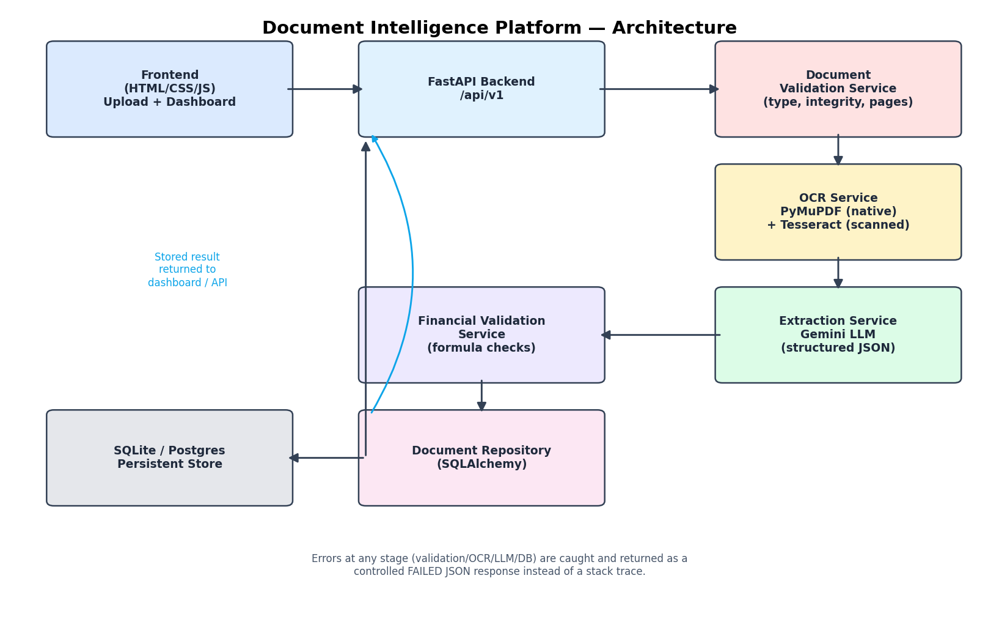

# Document Intelligence Platform

An end-to-end AI-powered document extraction, validation and API platform for
**invoices, balance sheets, profit & loss statements, and cash flow statements**
(PDF / JPG / PNG). Built for the AI Engineer Internship technical case study.

> ⚠️ **Before you deploy:** this repo ships without an LLM key. Set
> `GEMINI_API_KEY` (see [Environment variables](#environment-variables)) or
> extraction will fail gracefully with `LLM_NOT_CONFIGURED` — validation, OCR,
> storage and the dashboard all work regardless, as shown in
> `sample_outputs/real_run_02_invoice_missing_llm_key.json`.

---

## 1. Solution overview & architecture



**Pipeline:** Upload → File Validation → OCR/Text Extraction → AI Field &
Table Extraction (LLM) → Financial Calculation Validation → Persist → Dashboard/API.

Every stage is a separate service (see [Repository structure](#8-repository-structure))
so OCR, extraction, validation and persistence can each be modified or swapped
independently. Failures at any stage are caught and converted into a
controlled `FAILED` JSON response — the service never returns a raw stack
trace to the caller (see `app/utils/exceptions.py` and `document_service.py`).

## 2. Technology stack & why

| Concern | Choice | Why |
|---|---|---|
| API framework | **FastAPI** | Async, built-in OpenAPI/Swagger docs at `/docs`, first-class Pydantic validation |
| Frontend | **Server-rendered HTML/CSS + vanilla JS**, served by the same FastAPI app via Jinja2 templates | Meets the "HTML/CSS, optional JS" requirement while deploying as **one** service — simplest possible free-tier deployment |
| Native PDF text | **PyMuPDF (fitz)** | Fast, accurate embedded-text extraction, also used to rasterize pages for OCR fallback |
| OCR | **Tesseract (pytesseract)** | Free, open-source, no API key, works fully offline |
| AI field/table extraction | **Google Gemini** (`gemini-2.0-flash`, `response_mime_type=application/json`) | Generous free tier, native structured-JSON output, good at long-context document text |
| Database | **SQLite** (via SQLAlchemy, swappable to Postgres via `DATABASE_URL`) | Zero-setup persistence that satisfies the "database-backed dashboard" requirement on a free tier |
| Deployment | **Docker on Render** | One Dockerfile builds both backend + frontend + Tesseract; free tier available |

## 3. Local setup instructions

**Prerequisites:** Python 3.11+, Tesseract OCR installed locally
(`sudo apt-get install tesseract-ocr` on Debian/Ubuntu, `brew install tesseract` on macOS).

```bash
cd backend
python -m venv .venv && source .venv/bin/activate     # Windows: .venv\Scripts\activate
pip install -r requirements.txt

cp ../.env.example .env      # then edit .env and set GEMINI_API_KEY
# from inside backend/, with PYTHONPATH set to the backend folder:
PYTHONPATH=. uvicorn app.main:app --reload --port 8000
```

Open:
- Dashboard: http://localhost:8000/
- Swagger/OpenAPI docs: http://localhost:8000/docs
- Health check: http://localhost:8000/api/v1/health

Run tests:
```bash
cd backend
PYTHONPATH=. pytest tests/ -v
```

## 4. Environment variables

See `.env.example` at the repo root. Copy it to `backend/.env`. Key variables:

| Variable | Purpose |
|---|---|
| `GEMINI_API_KEY` | **Required for extraction to succeed.** Get a free key at https://aistudio.google.com/apikey |
| `GEMINI_MODEL` | Defaults to `gemini-2.0-flash` |
| `DATABASE_URL` | Defaults to local SQLite file; set to a Postgres URL for a managed DB |
| `MAX_PAGES` | Page limit for uploads (default 3, per spec) |
| `MAX_FILE_SIZE_MB` | Upload size guard (default 15MB) |
| `VALIDATION_TOLERANCE_PCT` / `VALIDATION_TOLERANCE_ABS` | Numerical tolerance for financial checks (max of the two is used) |

No secrets are committed — `.env` is git-ignored; only `.env.example` (with placeholders) is tracked.

## 5. Deployed Application URLs

*(Fill these in after you deploy — see Section 7 below)*

- Frontend / Dashboard: `<your-render-url>/`
- Backend API base: `<your-render-url>/api/v1`
- Swagger/OpenAPI: `<your-render-url>/docs`
- Health: `<your-render-url>/api/v1/health`
- Public GitHub repository: `<your-repo-url>`

## 6. API reference & examples

| Method | Endpoint | Purpose |
|---|---|---|
| POST | `/api/v1/documents/process` | Upload & process a PDF/JPG/PNG |
| GET | `/api/v1/documents/{document_name}` | Latest structured result for a document name |
| GET | `/api/v1/documents` | List all processed documents (feeds the dashboard) |
| GET | `/api/v1/health` | Health check |

**Upload & process:**
```bash
curl -X POST http://localhost:8000/api/v1/documents/process \
  -F "file=@sample_invoice.jpg" \
  -F "document_type=invoice"
```
`document_type` must be one of: `invoice`, `balance_sheet`, `profit_and_loss`, `cash_flow_statement`.

**Get by name:**
```bash
curl http://localhost:8000/api/v1/documents/sample_invoice.jpg
```

**List (dashboard feed):**
```bash
curl http://localhost:8000/api/v1/documents
```

Full request/response envelope: see `sample_outputs/illustrative_04_invoice_full_success_once_llm_key_set.json`.

## 7. Deployment (Render, free tier)

This repo includes a `Dockerfile` (root) and a `render.yaml` Blueprint.

**Option A — Blueprint (fastest):**
1. Push this repo to a **public** GitHub repository.
2. In Render: **New → Blueprint**, point it at your repo. Render reads `render.yaml` automatically.
3. Set `GEMINI_API_KEY` in the Render dashboard's Environment tab (it's marked `sync: false` so it's never committed).
4. Deploy. Render builds the Docker image (installs Tesseract + Python deps) and starts `uvicorn`.

**Option B — Manual Web Service:**
1. **New → Web Service**, connect your repo, runtime = **Docker**, Dockerfile path = `./Dockerfile`, context = repo root.
2. Add the same environment variables as in `.env.example`.
3. Health check path: `/api/v1/health`.

SQLite is used by default; because Render's free-tier disk is ephemeral across deploys,
switch `DATABASE_URL` to a managed Postgres instance (Render offers a free Postgres tier)
for data to survive redeploys during evaluation.

Railway/Koyeb work the same way — both build from the same `Dockerfile` and just need
the same environment variables set.

## 8. Repository structure

```
project-root/
├── backend/app/            # FastAPI app: api/, core/, models/, schemas/, services/, repositories/, utils/
├── backend/tests/          # pytest suite (validation, extraction, API flow)
├── frontend/               # Jinja2 templates + static CSS/JS, served by the same app
├── docs/architecture.png   # architecture diagram
├── sample_outputs/         # real captured pipeline outputs + one illustrative full-success example
├── Dockerfile, render.yaml # deployment
└── .env.example
```

## 9. OCR / LLM used

- **OCR/parsing:** PyMuPDF for native PDF text; Tesseract (pytesseract) OCR fallback for
  scanned PDFs (per-page, triggered automatically when a page has < 20 extractable
  characters) and for JPG/PNG images. Both are free/open-source, no API key required.
- **LLM:** Google Gemini (`gemini-2.0-flash`), called with `response_mime_type=application/json`
  so the model returns parseable JSON directly (see `app/services/extraction_service.py`).
  The prompt explicitly forbids inventing values — missing fields must be `null`.

## 10. Confidence scoring

Optional, as permitted by the brief. When the LLM includes a `confidence` value per
field, `overall_confidence` on the response is the mean of all field confidences.
No confidence is fabricated when the model doesn't provide one (fields simply omit it).

## 11. Financial validation rules & tolerance

Implemented in `app/services/financial_validation_service.py`, one function per
document type, covering the **minimum required checks from the brief**:

- **Invoice:** `subtotal + tax_amount − discount ≈ total_amount`; `cash_paid − total_amount ≈ change` (when present).
- **Balance Sheet:** `total_liabilities + total_equity ≈ total_assets`.
- **Profit & Loss:** `revenue − cost_of_sales ≈ gross_profit`; `gross_profit − operating_expenses ≈ operating_profit`; `operating_profit − tax ≈ net_profit`.
- **Cash Flow:** `operating + investing + financing cash flow ≈ net_change_in_cash`; `opening_cash + net_change_in_cash ≈ closing_cash`.

A check is **NOT_APPLICABLE** whenever a required input field wasn't extracted (never
assumed). **Tolerance:** `max(VALIDATION_TOLERANCE_ABS, |reported_value| × VALIDATION_TOLERANCE_PCT)`,
defaulting to the larger of 1.0 (absolute) or 1% — accounting for OCR/rounding noise
without masking real mismatches.

Field names in real documents vary a lot ("total_liabilities" vs "total capital &
liabilities", etc.), so lookups use a small alias table (see `_find_value` /
`MIN_FIELDS_BY_TYPE`) rather than one rigid key per concept.

## 12. Database / persistence

`ProcessedDocument` (SQLAlchemy model, `app/models/document.py`) stores the document
name, type, status, full result JSON, confidence and timestamps. `GET /api/v1/documents/{name}`
returns the most recent row for that name (older ones are kept, not deleted — prior
versions are simply not surfaced by that endpoint). `GET /api/v1/documents` powers the
dashboard list.

## 13. Known limitations

- Multi-period (comparative-year) financial validation is **not** implemented per-period;
  checks currently run once against whatever single set of totals the extractor returns.
  For statements with multiple years on one page, the LLM may merge the most prominent
  period's figures. **Production fix:** have the extraction prompt tag each value with an
  explicit `period` key and loop the validators over each period.
- Document-type is supplied by the frontend (as specified) — there is no automatic
  document-type classification.
- Confidence scores (when present) come directly from the LLM's own self-reported
  value, not from a separate calibration model.
- OCR quality on low-resolution/skewed scans (several sample images in the provided
  dataset) is noisy; this affects downstream extraction accuracy on those specific files
  more than the code logic itself.
- SQLite is fine for the assessment; under concurrent load a managed Postgres instance
  (already supported via `DATABASE_URL`) would be needed.

## 14. What I'd change for production

- Move OCR/LLM calls to a background task/queue (Celery/RQ) with the POST endpoint
  returning `202 Accepted` + a status-polling endpoint, instead of processing synchronously.
- Add per-period structured extraction and validation for multi-year statements.
- Add authentication/rate-limiting on the API, and object storage (S3-compatible) for
  the original uploaded files instead of discarding them after processing.
- Add a proper confidence-calibration step (e.g., cross-checking OCR-vs-LLM agreement)
  rather than relying solely on the LLM's self-reported confidence.
- Structured JSON-schema-enforced extraction (Gemini `response_schema`) once the fixed
  vs. flexible field-list tension is resolved with the business.

## 15. AI coding assistants used

This project was developed with the assistance of Claude (Anthropic) as a coding collaborator, in accordance with the case study's permitted-use policy for generative AI tools. Claude was used to scaffold the backend architecture, service layer, API routes, frontend, test suite, and deployment configuration based on the case study brief and the provided sample dataset.

All generated code was reviewed, executed, and validated end-to-end before submission — including live testing against the sample dataset (see sample_outputs/ for genuine captured pipeline outputs).
